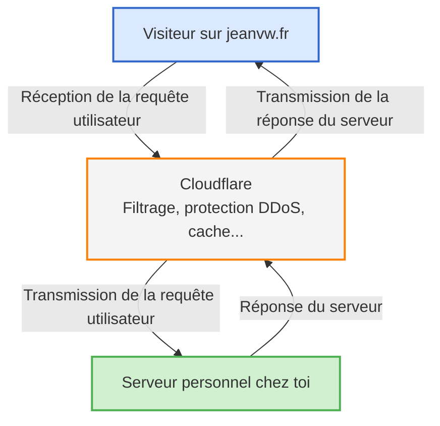
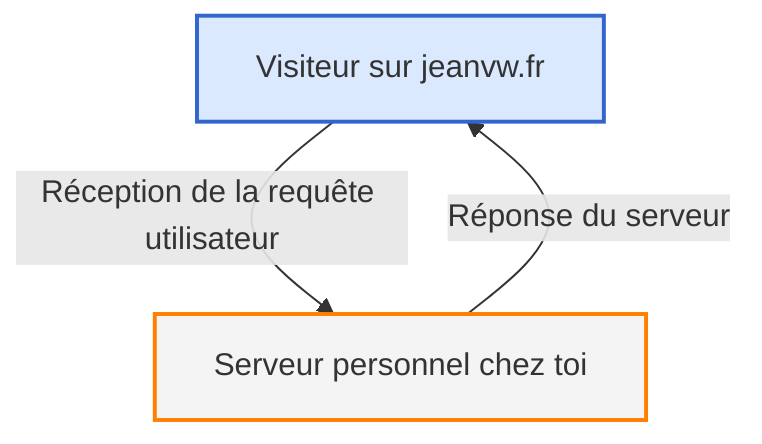

Dans cette suite d’articles, je vais vous montrer comment j’ai monté mon homelab de A à Z. On va voir ensemble toutes les étapes à suivre, pas à pas, en gardant les choses simples et claires pour que même les débutants puissent suivre.

---

## Introduction

Dans cet article, je vais vous expliquer comment j’ai acheté un nom de domaine chez OVH, puis comment je l’ai configuré via Cloudflare pour bénéficier de leurs protections gratuites, notamment contre les attaques DDoS.

---

## Qu'est-ce qu'un nom de domaine ?

> [!note]
> Un **nom de domaine**, c’est l’adresse lisible par les humains qu’on tape dans un navigateur pour accéder à un site web, comme *google.com* ou *jeanvw.fr*.
> Il remplace une adresse IP (ex: `172.217.0.46`) par un nom facile à retenir. C’est un peu comme un contact dans ton téléphone: au lieu de retenir un numéro, tu retiens un nom.

Dans un homelab, l’achat d’un nom de domaine **n’est pas obligatoire**, mais il devient **fortement recommandé** dès qu’on souhaite :
- héberger un ou plusieurs sites web,
- sécuriser ses services avec HTTPS (certificats SSL),
- ou simplifier l’accès depuis l’extérieur.

---

## Achat d’un nom de domaine chez OVH

Je suis personnellement passé par :link[OVH]{id=https://www.ovhcloud.com/fr/}, mais la plupart des **registrars** proposent un processus similaire.

> [!note]
> Un **registrar** est une entreprise accréditée pour vendre et gérer des noms de domaine (ex: OVH, Gandi, GoDaddy, Namecheap…).

### Étapes d’achat

1. Rendez-vous sur la page d’accueil d’OVH.
2. Recherchez le nom de domaine souhaité.

(style:width:100%)

> Évitez les accents et espaces dans le nom de domaine. Les tirets (`-`) sont autorisés.

3. S’il est disponible, achetez-le en suivant les étapes.
   > ⚠️ Le prix est souvent très bas la première année, mais augmente nettement ensuite.

Une fois l’achat terminé, allez dans votre **espace client OVH**.

(style:width:100%)

Dans la liste de vos services, sélectionnez votre domaine (`Type: Domaine`), puis cliquez sur `Action > Voir le détail du service`.

(style:width:100%)

Cela vous ouvrira votre tableau de bord OVH pour configurer votre nom de domaine (on va on avoir besoin plus tard dans l'article).

---

## Pourquoi passer par Cloudflare ?

Quand j’ai commencé, je voulais juste avoir un site et un serveur Minecraft. C'est seulement plus tard, à force de regarder des vidéos et de me renseigner sur la sécurisation de mon homelab, que j'ai réalisé que **Cloudflare offrait des protections gratuites très utiles** :

- Protection DDoS
- Cache et CDN
- Masquage de l’IP réelle
- Interface de gestion DNS moderne

OVH ne propose pas ce type de protection gratuitement. Cloudflare étant aussi un registrar, on pourrait tout faire chez eux, mais comme j'avais déjà acheté mon domaine ailleurs, je l’ai simplement **"enrollé" chez Cloudflare**.

---

## Qu’est-ce qu’un DNS ?

> [!note]
> Le **DNS** (Domain Name System) est comme l’annuaire d’Internet.
> Il traduit un nom de domaine (comme *jeanvw.fr*) en adresse IP (comme `160.182.22.13`) pour que le navigateur sache où se connecter.

En reliant votre nom de domaine à **l’adresse IP publique** de votre box via les DNS, vous permettez à n’importe qui d’accéder à vos services.

Avec Cloudflare, il est possible de masquer votre adresse IP réelle grâce au proxy:
- Cloudflare agira alors comme un intermédiaire.
- Il filtrera les requêtes et les redirigera vers votre adresse IP **seulement si elles sont sûres**.

---

## Enrôler son domaine chez Cloudflare

### Création du compte & ajout du domaine

1. Créez un compte sur :link[Cloudflare]{id=https://cloudflare.com/}.
2. Ensuite, rendez-vous dans votre :link[tableau de bord]{id=https://dash.cloudflare.com/} puis cliquez sur `Onboard a domain`.

(style:width:100%)

3. Entrez votre nom de domaine.

(style:width:100%)

4. Choisissez une offre (la gratuite suffit largement).

(style:width:100%)

5. Cloudflare va scanner votre configuration actuelle pour vous faciliter la transition.

(style:width:100%)

---

## Redirection des DNS vers Cloudflare

Dans l'étape suivante, Cloudflare vous donnera deux serveurs DNS à indiquer chez votre registrar (OVH dans mon cas), ainsi qu’un message pour **désactiver le DNSSEC**.

(style:width:100%)

### Étapes chez OVH

1. Allez dans le tableau de bord de votre domaine.

(style:width:100%)

2. Désactivez le **DNSSEC**.
3. Dans l’onglet `Serveurs DNS`, remplacez les valeurs actuelles par celles fournies par Cloudflare.

(style:width:100%)

Une fois validé, la propagation peut prendre quelques minutes.

---

## Configuration minimale sur Cloudflare

Dès que le domaine est actif (vous pouvez voir cela :link[ici]{id=https://dash.cloudflare.com/}), cliquez dessus pour ouvrir le tableau de bord de votre nom de domaine puis allez dans la section `DNS` pour **ajouter vos premières entrées**.

(style:width:100%)

Cliquez sur `Add record` puis remplissez :

- **Type**: A
- **Nom**: `@` (racine du domaine)
- **Adresse**: votre IP publique (celle de votre box)
- **Proxy status**: activé ou désactivé selon vos besoins

(style:width:100%)

> [!tip]
> Le proxy Cloudflare **masque votre IP publique** et filtre les requêtes.<br>
> Si le **proxy est activé**, Cloudflare agit comme intermédiaire : il masque votre IP et applique ses protections avant de transmettre la requête à votre serveur.<br>
> Si le **proxy est désactivé**, la requête va directement vers votre serveur sans passer par Cloudflare.

---

## Vérification

Pour tester, ouvrez une invite de commande (cmd) et tapez :

```bash
ping votre-nom-de-domaine.fr
```

- **Proxy désactivé**: l’IP renvoyée correspond à celle de votre box
- **Proxy activé**: l’IP renvoyée appartient à Cloudflare et vous pouvez vérifier cela en la comparant avec cette :link[liste]{id=https://www.cloudflare.com/fr-fr/ips/}
- **Autre chose ?**: RIP il doit s'agir d'une mauvaise configuration 🫠

> Si le proxy est activé et que l'adresse IP n'est pas dans la liste des IP Cloudflare, il se peut qu'elle ne soit simplement pas à jour. Vous pouvez vérifier cela en faisant `curl -I votre-nom-de-domaine.com` et dans la réponse vous devriez voir `Server: Cloudflare`.

---

## Résumé visuel

Voici un petit schéma pour illustrer le fonctionnement du DNS avec Cloudflare lorsque **vous avez activer le proxy Cloudflare** pour votre nom de domaine:



Voici le schéma si vous n'**activez pas le proxy Cloudflare** sur votre nom de domaine:



---

## Conclusion

Et voilà ! Vous avez :
- acheté un nom de domaine,
- enrôlé celui-ci chez Cloudflare,
- protégé votre homelab contre les attaques courantes,
- et configuré les premières entrées DNS.

Encore une étape franchie dans la création de votre homelab 💪  
On se retrouve très vite dans le prochain article !
