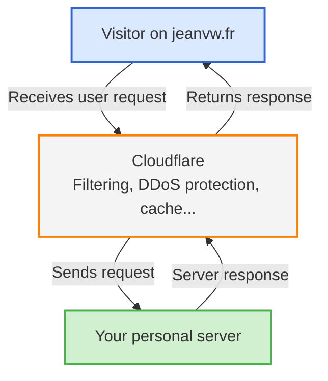
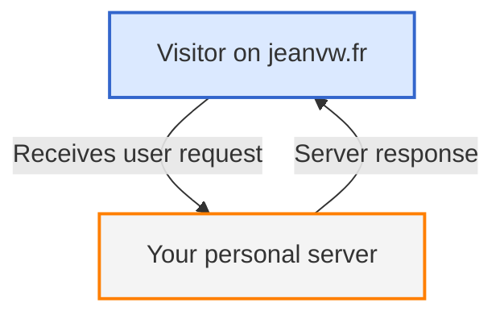

In this article series, I’ll show you how I built my homelab from A to Z. We’ll go through every step together, keeping things simple and clear so even beginners can follow along.

---

## Introduction

In this article, I’ll explain how I bought a domain name from OVH and then configured it using Cloudflare to benefit from their free protection features (especially against DDoS attacks).

---

## What’s a domain name?

> [!note]
> A **domain name** is the human-friendly address you type into your browser to reach a website, like *google.com* or *jeanvw.fr*.<br>
> It replaces an IP address (e.g. `172.217.0.46`) with something easier to remember. Think of it like a phone contact: instead of remembering the number, you remember a name.

In a homelab, buying a domain name **isn’t required**, but it becomes **highly recommended** if you want to:
- host one or more websites,
- secure your services with HTTPS (SSL certificates),
- or simplify remote access.

---

## Buying a domain name from OVH

I personally used :link[OVH]{id=https://www.ovhcloud.com/en/}, but most **registrars** follow a similar process.

> [!note]
> A **registrar** is a company accredited to sell and manage domain names (e.g., OVH, Gandi, GoDaddy, Namecheap…).

### Steps

1. Visit OVH’s homepage.
2. Search for the domain you’d like to buy.

(style:width:100%)

> Avoid accents or spaces in domain names. You can use hyphens (`-`) instead.

3. If it’s available, proceed with the purchase.
   > ⚠️ Prices are often very low the first year, then increase significantly afterward.

Once you’ve purchased the domain, head to your **OVH dashboard**.

(style:width:100%)

From your list of services, find your domain (`Type: Domain`) and click `Action > View service details`.

(style:width:100%)

This opens the OVH dashboard you’ll use to configure the domain (we’ll need this later).

---

## Why use Cloudflare?

Initially, I just wanted a basic website and a Minecraft server. But after diving into homelab security best practices, I discovered that **Cloudflare offers great free protection**, including:

- DDoS protection
- Caching and CDN
- IP address masking
- Modern DNS dashboard

OVH doesn’t offer this kind of free protection. Cloudflare is also a registrar, so you could buy your domain directly from them. But since I had already purchased mine from OVH, I simply **enrolled it into Cloudflare**.

---

## What’s a DNS?

> [!note]
> **DNS** (Domain Name System) works like the phonebook of the internet.<br>
> It translates domain names (like *jeanvw.fr*) into IP addresses (like `160.182.22.13`) so your browser knows where to connect.

By linking your domain to your **public IP address**, you allow external users to access your services.

With Cloudflare’s **proxy mode**, you can even hide your real IP:
- Cloudflare acts as an intermediary.
- It filters requests and only forwards valid ones to your actual server.

---

## Enrolling your domain with Cloudflare

### Create an account & add your domain

1. Create a free account at :link[Cloudflare]{id=https://cloudflare.com/}.
2. Go to your :link[dashboard]{id=https://dash.cloudflare.com/} and click `Onboard a domain`.

(style:width:100%)

3. Enter your domain name.

(style:width:100%)

4. Choose a plan (the free one is more than enough).

(style:width:100%)

5. Cloudflare will scan your current DNS settings to help you migrate.

(style:width:100%)

---

## Pointing DNS to Cloudflare

Next, Cloudflare will provide you with two nameservers to set at your registrar (OVH in my case), and tell you to **disable DNSSEC**.

(style:width:100%)

### Steps on OVH

1. Open your OVH domain dashboard.

(style:width:100%)

2. Disable **DNSSEC**.
3. In the `DNS Servers` tab, replace the default OVH nameservers with the ones from Cloudflare.

(style:width:100%)

Once confirmed, DNS propagation may take a few minutes.

---

## Basic DNS setup on Cloudflare

Once your domain is active (you can check that :link[here]{id=https://dash.cloudflare.com/}), click it in the dashboard and go to the `DNS` tab.

(style:width:100%)

Click `Add record` and fill out the fields:

- **Type**: A
- **Name**: `@` (the root of your domain)
- **IPv4 address**: your public IP (the one from your home internet box)
- **Proxy status**: on or off depending on your needs

(style:width:100%)

> [!tip]
> With **proxy ON**, Cloudflare hides your real IP and filters traffic before sending it to your server.<br>
> With **proxy OFF**, traffic goes directly to your server.

---

## Test it

To test, open a terminal and run:

```bash
ping your-domain-name.fr
```

- **Proxy OFF**: you’ll see your home IP address
- **Proxy ON**: the IP will be a Cloudflare IP (you can verify it using this :link[official list]{id=https://www.cloudflare.com/en-gb/ips/})
- **Something else?** Might be a misconfiguration 🫠

> If proxy is ON but the IP isn’t in Cloudflare’s list, try running `curl -I your-domain.com`. If it replies with `Server: Cloudflare`, it means it’s working.

---

## Visual Summary

Here’s a simple diagram showing how DNS and Cloudflare work when **proxy is enabled**:



Here’s what it looks like when **proxy is disabled**:



---

## Conclusion

And there you go! You’ve now:
- bought a domain name,
- enrolled it into Cloudflare,
- protected your homelab against common threats,
- and configured your first DNS entries.

Another important milestone reached in your homelab journey 💪  
See you in the next article!
