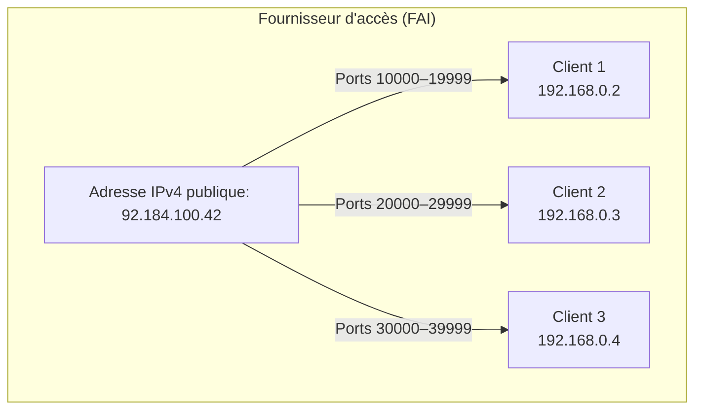

Dans cette suite d’articles, je vais vous montrer comment j’ai monté mon homelab de A à Z. On va voir ensemble toutes les étapes à suivre, pas à pas, en gardant les choses simples et claires pour que même les débutants puissent suivre.

Comme j’utilise une Bbox comme box internet, ce tutoriel s’appuie sur celle-ci. Si vous avez une box différente (Livebox, Freebox, etc.), le principe restera le même, mais certaines étapes peuvent varier. Je vous invite donc à chercher la documentation propre à votre fournisseur d’accès.

## Qu’est-ce qu’une adresse IPv4 ?

> [!note]
> **IPv4** (Internet Protocol version 4) est une norme qui permet d’identifier de manière unique chaque appareil connecté à un réseau. 
> Une adresse IPv4 est composée de 4 nombres entre 0 et 255, séparés par des points. Exemple : **192.168.1.254**

> *Est-ce que ça signifie que chaque appareil connecté à Internet a sa propre adresse IPv4 ?*

Oui… mais pas tout à fait.

## Réseau local (LAN) vs Réseau Internet (WAN)

Pour bien comprendre comment tout cela fonctionne, il faut distinguer deux types de réseaux :

- **Le réseau local (LAN)** : c’est votre petit réseau privé à la maison. Il relie vos appareils entre eux (PC, téléphone, imprimante, etc.) via votre box.
- **Le réseau étendu (WAN)** : c’est Internet, le grand réseau mondial auquel votre box est connectée.

Votre **box Internet** joue donc un rôle de **pont** entre ces deux mondes :
- D’un côté, elle attribue à chaque appareil une **adresse locale** (comme `192.168.1.42`) pour communiquer dans le réseau domestique.
- De l’autre, elle possède **une adresse publique** (comme `92.184.100.42`) qui est visible sur Internet.

> [!note]
> Une adresse locale (LAN) **ne fonctionne que chez vous**. 
> Une adresse publique (WAN) est **la seule visible de l’extérieur**.

C’est pourquoi, **même si votre ordinateur a une adresse IPv4**, il **n’est pas directement visible depuis Internet**. C’est **votre box** qui sert d’intermédiaire pour acheminer les échanges.

> [!tip]
> On peut comparer ça à une entreprise :
> - Vos appareils sont comme les employés avec des numéros internes.
> - La box est la réception.
> - Et l’adresse publique est le numéro de téléphone de l’entreprise visible depuis l’extérieur. Il mène à l'accueil, qui s'occupera ensuite de rediriger vers le bon employé.

## Les limites du protocole IPv4

Quand le protocole IPv4 a été conçu, personne n’imaginait qu’un jour **chaque personne aurait plusieurs appareils connectés** à Internet. À l’origine, Internet était réservé à une poignée de chercheurs, pas au grand public.

> [!note]
> Il n’existe qu’environ **4,3 milliards d’adresses IPv4** possibles (car une IPv4 est composée de 4 nombres entre 0 et 255, soit 256⁴ combinaisons). 
> Pour faire face à cette limite, un nouveau protocole a été créé : **IPv6**. Il fonctionne comme l’IPv4 mais avec des adresses beaucoup plus longues, permettant un nombre quasiment infini de combinaisons.

C’est justement pour cette raison que les **fournisseurs d’accès à Internet (FAI)** mutualisent généralement les adresses IPv4, pour les économiser.

Autrement dit, ils vont souvent regrouper **plusieurs clients** (par exemple 3 ou 4 voisins) sur **la même adresse IPv4 publique**. Pour distinguer les connexions de chaque client, le FAI leur assigne **des plages de ports différentes**.

> [!note]
> Un **port** est un point de communication logique. Il permet à un appareil de faire plusieurs connexions en même temps via la même adresse IP.
>
> Exemple : `192.168.1.10:80` signifie "l’adresse IP locale 192.168.1.10 sur le port 80 (service web)".
>
> Il existe **65 536 ports**, numérotés de 0 à 65535.

## Pourquoi avons-nous besoin d'une IP publique dédiée pour notre homelab ?

Lorsque vous mettez en place un homelab, le but est souvent de pouvoir **accéder à vos services depuis l’extérieur**, par exemple pour :
- héberger un site,
- accéder à un NAS,
- contrôler un serveur à distance,
- exposer des API, etc.

Le souci, c’est que par défaut, la plupart des connexions à Internet chez les particuliers sont configurées de manière **dynamique et mutualisée** :
- **Dynamique** : votre adresse IP publique peut changer à tout moment (au redémarrage de la box ou de temps en temps).
- **Mutualisée** : vous partagez cette IP publique avec d'autres clients du FAI. Le fournisseur vous alloue seulement **une plage de ports**, et garde le reste pour d'autres clients.

Cela pose deux problèmes pour un homelab :
1. Vous n’avez **pas accès à tous les ports**, ce qui limite fortement les services que vous pouvez exposer.
2. Votre adresse IP publique **peut changer**, rendant vos configurations obsolètes (DNS, redirections, accès distant…).

Ce que l’on souhaite donc, c’est **obtenir une adresse IPv4 publique fixe et dédiée** :
- Elle vous appartient, vous ne la partagez pas avec d'autres.
- Vous récupérez **l’accès complet à tous les ports (1 à 65535)**.
- Elle **ne change jamais**, même après un redémarrage de la box.

## Connexion à votre compte client Bouygues Telecom

Pour accéder à votre espace client Bouygues Telecom, rendez-vous sur ce site: :link[Mon compte Bouygues]{id=https://www.bouyguestelecom.fr/mon-compte}

Connectez-vous avec vos identifiants.

> [!tip]
> Si vous avez oublié votre mot de passe, vous pouvez le réinitialiser en appuyant sur :link[mot de passe oublié ?]{id=https://www.bouyguestelecom.fr/connexion/mot-de-passe-oublie}

## Configuration de l'IPv4 publique dédiée

Une fois connecté, vous arriverez sur une page qui liste vos abonnements ("lignes").
Il vous suffit de sélectionner celle de votre Bbox, elle aura une icône ressemblant à ceci:

(style:width:10%)

Cela vous emmènera sur la page de configuration de votre Bbox sur laquelle vous n'aurez qu'à descendre vers la section `Options` puis d'appuyer sur le bouton `Ajouter une option`.
Une fois redirigé vers la nouvelle page, sélectionnez l'onglet `Pratique` et tadam ! Vous verrez l'option IP dédiée:

(style:width:70%)

Dans votre cas elle ne sera pas déjà activée donc il vous suffira de la sélectionner puis d'appuyer sur le bouton `Souscrire`.

> [!caution]
> Avant de souscrire à cette option, vérifiez qu'elle est bien inclus dans votre offre. Il devrait y avoir un petit message vous indiquant si c'est le cas en haut du bouton souscrire.

Une fois l'option ajoutée, les changements vont s'effectuer, votre box va redémarrer et sous les 15 minutes cela devrait être effectif.

Félicitations, vous êtes à une étape de moins de votre homelab 😁
