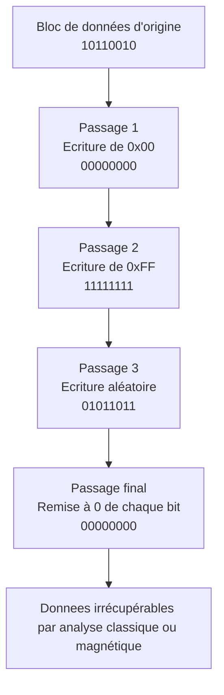

## Pourquoi effacer son disque avec des outils spécialisés ?

> ***Saviez-vous que lorsque vous supprimez des fichiers sur un appareil, il n'est en réalité pas réellement supprimé ?***

Cela peut paraître contradictoire mais c'est bien ce qui se passe dans les coulisses. Pour l'ordinateur, effectuer cette action de suppression est superflue. Cela l'oblige à effectuer des actions qui ne serviront pas à grand chose.

Voyons rapidement comment les fichiers sont stockés sur un disque.

> [!note]
> Un système de fichiers, c’est comme une sorte de carte ou de plan que l’ordinateur utilise pour savoir où et comment ranger les fichiers sur un disque (clé USB, SSD, disque dur…).
> Il permet de retrouver un fichier rapidement, de savoir combien de place il prend, où il commence et où il finit.
> Il en existe plusieurs types (FAT32, NTFS, ext4…), mais le principe reste le même : organiser les données pour que le système sache où aller les lire ou les écrire.

Les différents types de systèmes de fichiers fonctionne tous de la même façon. Chaque information devant être stockée sur votre ordinateur sera enregistrée dans un tableau, souvent appelé **table d’allocation de fichiers** (pour **FAT32**: ***File Allocation Table*** et pour les systèmes de fichiers plus récents comme **NTFS**: ***Master File Table (MFT)***). Il contiendra plusieurs informations telles que le nom du fichier, sa date de création, sa taille et le plus important, où il est stocké dans la mémoire. En connaissant sa taille et l'endroit où il commence à être stocké, l'ordinateur peut donc aller lire cette zone mémoire afin de vous afficher le contenu du fichier.

Donc lorsque vous supprimez un fichier, il va en réalité simplement venir éditer ce tableau pour indiquer que le fichier est supprimé. Ainsi, la zone mémoire ne sera plus liée à ce fichier et elle pourra donc être utilisée par l'ordinateur à l'avenir pour stocker de l'information.

Cela permet d’économiser des ressources: la suppression est rapide et peu coûteuse pour le système. De plus, ça n'affecte en rien le bon fonctionnement de celui-ci.
Cependant, il y a certains cas où cela peut nous desservir ou bien au contraire, nous arranger. 

Par exemple, grâce à cela, nous pouvons récupérer nos fichiers supprimés depuis la corbeille ou encore récupérer les informations d'un disque dans le cadre d'enquête forensique. Il nous faut donc être conscient de cela afin de nous protéger, notamment dans le cadre professionnel. Imaginez si un ordinateur d'entreprise, comprenant toutes ces données, est hors-service puis jeté. Le disque est lui probablement toujours fonctionnel et grâce à des outils, les informations qu'il contient pourraient être en partie voire même entièrement récupérées. D'où l'importance de bien prendre le temps d'effacer le contenu de ses appareils avant de s'en séparer, peu importe la raison.

> ***Dans ce cas, il nous suffit de le réinitialiser et voilà, le tour est joué !***

On pourrait croire que cela suffit à effacer proprement toutes les données de l'ordinateur mais en réalité, ce n’est pas aussi fiable que ça.

Comme vous le savez sûrement, un ordinateur stocke les données sous forme binaire, c’est-à-dire des suites de 0 et de 1. Lorsqu’on réinitialise un PC, le système efface les données visibles en les remplaçant par des zéros. Cela les rend inaccessibles, mais pas forcément irrécupérables.

> [!warning]
> Réinitialiser un disque ou supprimer un fichier ne garantit **pas** sa disparition totale. Si vous vendez, donnez ou recyclez un appareil, **utilisez un outil d'effacement sécurisé** pour éviter que des données personnelles ne soient récupérées.

Certaines méthodes de récupération avancées sont capables de retrouver partiellement les anciennes données. 
Comment ? 
Cela fonctionne grâce à une analyse fine des résidus magnétiques présents sur le disque Même après avoir écrit un 0 à la place d’un 1, il peut rester une trace physique de l’ancien état, suffisamment subtile pour qu’un outil spécialisé devine ce qui était là avant.

C'est pour cela qu'il existe des outils conçus pour de l'effacement sécurisé (shred, DBAN, etc.) car la réinitialisation seule ne garantit pas un effacement définitif.

Concrètement, ces outils vont venir effectuer plusieurs passes sur le disque (plusieurs tours) en utilisant des algorithmes d'effacement. Ça paraît complexe (et ça l’est sûrement !), mais ce qu'il faut retenir c'est que ces outils vont venir changer l'état de chaque bit en fonction du nombre de passes, puis finir par le remettre à 0 pour finir.

Dans cet article, je vais vous présenter le fonctionnement de l'outil ShredOS qui permet d'effacer de manière sécurisée son disque. Il s'agit d'un outil open source donc accessible à tous.

---

## Prérequis

Vous allez avoir besoin:
- D'une clé USB vierge
- Rufus
- ShredOS

---

## Installation de Rufus et de ShredOS

Dans un premier temps, nous allons devoir télécharger Rufus. Il s'agit d'un logiciel qui va nous permettre de venir graver ShredOS sur une clé USB.

> ***Pourquoi est-ce nécessaire ?***

Par défaut, une clé USB contient elle-même un système de fichier. Rufus va donc venir supprimer son contenu afin de rendre la clé USB exécutable pour démarrer le programme ShredOS qu'on y mettra.

Je vous laisse donc installer ces 2 outils:
- :link[ShredOS]{id=https://github.com/PartialVolume/shredos.x86_64/releases/tag/v2024.02.2_26.0_x86-64_0.37}
- :link[Rufus]{id=https://rufus.ie/fr/}

> [!warning]
> Pour ShredOS, il se peut qu'il y ait de nouvelles versions disponibles sur le github, vous n'êtes donc pas obligé de sélectionner celle qui vous est fournie.
>
> Pour Rufus, nous aurons besoin de la version `Portable`.
> (style:width:70%)

Une fois les 2 outils installés, vous pouvez simplement exécuter Rufus. **Vous aurez besoin des droits administrateurs pour le lancer.**

(style:width:70%)

L'outil est simple d'utilisation:
1. On sélectionne la clé USB
2. On sélectionne l'ISO à graver dessus (dans notre cas ShredOS)
3. On appuie sur démarrer

Une fois terminé, il vous l'indiquera d'une barre verte en bas de l'écran avec écrit `PRÊT`.

---

## Préparation de la machine pour l'effacement du disque

Une fois la clé USB prête, vous allez devoir préparer votre machine pour la réinitialisation.
Cela va nécessiter quelques actions de notre part dans le BIOS de la machine.

> [!note]
> Le BIOS (pour Basic Input/Output System) est un petit programme intégré à la carte mère de ton ordinateur.
> Il s’exécute dès le démarrage de l’ordinateur **avant le système d’exploitation** (Windows, Linux, etc.).
> C’est lui qui permet de gérer les réglages de base, comme l’ordre de démarrage (clé USB, disque dur…), l’activation de certaines fonctions matérielles, ou encore les options de sécurité comme le Secure Boot.

Chaque BIOS est différent mais rassurez-vous, les actions restent les mêmes à effectuer, il faudra simplement les chercher au préalable. Google est votre ami si vous n'avez pas l'immense honneur d'avoir un Dell sous la main (car je vais faire la démo avec un PC Dell 😜).

Aller on s'y met !
1. Premièrement, on branche la clé USB.
2. Secondo, on allume l'ordinateur et on accède au BIOS. Pour ce faire, avec les PC Dell, il suffit d'appuyer sur `F2` pile lorsque le logo apparaît mais c'est plus fun de simplement spammer la touche jusqu'à ce que vous rentriez dans le BIOS.
3. Pour les changements à faire, on commence par s'assurer que le **secure boot** est bien **désactivé**. Pour ce faire, on se rend dans la section `Secure Boot > Secure Boot Enable` et on décoche la case:

(style:width:100%)

4. On vient ensuite s'assurer que le **Legacy Option ROM** est lui **activé**. Pour cela, direction la section `General > Advanced Boot Options` et on coche la case:

(style:width:100%)

5. Finalement, dans la section `General > Boot Sequence`, on doit sélectionner **Legacy External Devices**:

(style:width:100%)

Ces changements vont permettre de désactiver certaines sécurités de votre ordinateur pour qu'au prochain démarrage, il lance en premier le programme présent sur la clé USB plutôt que le programme installé sur votre disque dur (par exemple Windows).

6. Vous pouvez désormais appuyer sur le bouton `Apply` afin d'enregistrer les modifications puis sortir du BIOS. L'ordinateur devrait se rallumer tout seul en lançant le programme sur la clé USB.

> [!caution]
> Pensez à bien brancher votre ordinateur sur secteur pour éviter qu'il s'éteigne durant le processus d'effacement du disque dur.

---

## Utilisation de ShredOS

Dernière étape: configurer et lancer ShredOS.

Une fois redémarré, vous devriez tomber sur l'interface de shredos:

(style:width:70%)

Comme vous pouvez le voir sur l'image, l'interface est divisée en différentes sections:
- En haut à gauche: les configurations,
- En haut à droite: les statistiques,
- Au milieu de l'écran: Les différents disques disponibles,
- En bas de l'écran: les instructions de comment utiliser ShredOS

On va commencer par configurer ShredOS. Pour ce faire, on va suivre les instructions en bas de l'écran (Attention, le clavier est en QWERTY) afin d'effectuer ces changements:
- PRNG: XORoshiro-256
- Method: PRNG Stream
- Rounds: 4

> [!note]
> PRNG signifie "Pseudorandom Number Generator", c’est un générateur de données aléatoires utilisé ici pour brouiller efficacement l’ancienne info.

Pourquoi ces choix ? 
Eh bien, très simplement :
- XORoshiro-256 est un générateur de nombres pseudo-aléatoires réputé pour être rapide, fiable et suffisamment imprévisible pour ce qu’on veut faire ici.
- La méthode PRNG Stream utilise ce générateur pour remplir le disque avec des données aléatoires, ce qui rend les anciennes données extrêmement difficiles à retrouver.
- Enfin, faire 4 passes, ça veut dire qu’on va réécrire le disque 4 fois avec des données différentes, histoire d’être vraiment tranquille. Plus tu fais de passes, plus il est difficile (voire impossible) de récupérer quoi que ce soit derrière. Il est recommandé de faire minimum 3 passes pour effacer un disque de façon sécurisé.

Ensuite, vous devrez sélectionner le disque sur lequel vous voulez lancer le dispositif d'effacement. Vous pouvez sélectionner le bon disque avec les **flèches directionnelles** et la touche **espace**.

> [!caution]
> Faites attention de **ne pas sélectionner** la clé USB branchée sur l'ordinateur car sinon vous effaceriez le programme ShredOS qui sert à effacer 😂

Puis il vous suffira de lancer le programme en appuyant sur `SHIFT + S`.

Vous aurez un estimé du temps que prendra l'effacement du disque. Cela dépend de plein de facteurs tels que:
- la taille du disque,
- l'algorithme utilisé
- le nombre de passe

Pour ma part, avec les paramètres que vous avez ci-dessus, cela me prenait environ 1h30.

(style:width:100%)

Une fois arrivé à 100%, le programme aura terminé son travail et le disque sera entièrement effacé. Vous pourrez passer à l'écran suivant en appuyant sur `ENTER`.

(style:width:100%)

Finalement, vous n'aurez plus qu'à appuyer sur `s` pour éteindre l'ordinateur par exemple.

> [!caution]
> Comme votre disque a été entièrement effacé, vous aurez ensuite besoin de réinstaller un OS (Windows, Proxmox, Linux, etc.).
>
> Pensez également à rétablir les paramètres de sécurité que nous avions modifiés dans le BIOS au début.

Par ailleurs, vous retrouverez sur votre clé USB un certificat d'effacement si besoin.

---

## Conclusion

En résumé, bien effacer un disque ne se fait pas en 2 clics. Mais avec les bons outils, c’est accessible à tous. ShredOS en est la preuve: simple, rapide, et open source.

Que ce soit pour une revente, une mise au rebut ou juste votre tranquillité d’esprit: effacez proprement vos données.

Pour ma part, j'applique cela en entreprise mais aussi dans un cadre personnel lorsque, par exemple, j'ai reçu mon serveur. J'ai pris soin au préalable de nettoyer entièrement le disque afin d'éviter que certains programmes cachés dessus n'y restent (I am parano je sais mais bon, comme on dit, mieux vaut prévenir que guérir 😌).
