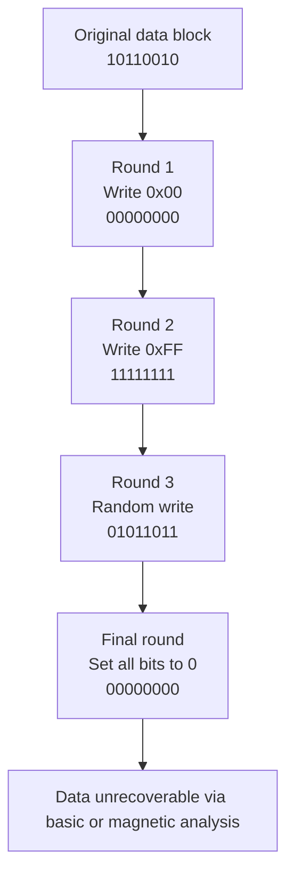

## Why use dedicated tools to wipe your drive?

> ***Did you know that when you delete files from a device, they’re not actually erased?***

It may sound counterintuitive, but that's exactly what's happening behind the scenes. For the computer, fully deleting a file is unnecessary. It would require more work for very little gain.

Let’s quickly look at how files are stored on a drive.

> [!note]
> A file system is like a map or a plan that the computer uses to know where and how to store files on a disk (USB drive, SSD, hard drive, etc.).
> It helps locate a file quickly, track its size, and know where it begins and ends.
> There are several types (FAT32, NTFS, ext4…), but they all follow the same principle: organizing data so the system knows where to read or write.

All file systems work in a similar way. Every piece of information stored on your machine is referenced in a table, often called a **File Allocation Table** (for **FAT32**) or a **Master File Table (MFT)** for more modern systems like **NTFS**. It contains details like the file name, creation date, size, and most importantly, its physical location on the drive. Knowing the start point and size, the computer can go directly to that location to read the data.

So when you delete a file, it doesn't actually remove the content, it just updates that table to mark the file as deleted. That memory area is now considered free to be reused later.

This saves resources: deletion is quick and efficient. And for most use cases, that’s perfectly fine.

However, in some cases, this behavior can backfire or actually help us. For example, it’s what allows you to recover files from the trash or conduct forensic recovery on a damaged drive. That's why we need to be aware of it, especially in professional contexts. Imagine disposing of a company laptop full of sensitive information. If someone retrieves the disk, they might be able to recover a lot of that data. That’s why securely wiping devices before getting rid of them is so important.

> ***So we just reset the computer and boom, problem solved, right?***

You’d think that would do the trick, but not quite.

As you probably know, computers store data in binary: sequences of 0s and 1s. When you reset a PC, it usually just replaces your data with zeros. That makes the data inaccessible… but not unrecoverable.

> [!warning]
> Resetting a drive or deleting a file doesn’t **guarantee** permanent deletion. If you're selling, donating, or recycling a device, **use a secure wiping tool** to make sure personal data can't be recovered.

Advanced tools are capable of recovering even some of the erased bits. 
How? 
By analyzing magnetic residue on the disk. Even if a 1 has been overwritten by a 0, subtle physical traces can remain, enough for specialized tools to guess what was originally there.

That's why tools like `shred`, `DBAN` and more exist: simple deletion or OS reset isn't enough.

In practice, these tools make multiple rounds on the disk using different overwrite patterns. Sounds complex (and it is!), but all you really need to know is that they modify each bit several times and then finish by zeroing them out again.

In this article, I’ll walk you through how to use **ShredOS**, an open source tool to securely wipe any drive.

---

## Requirements

You'll need:
- A blank USB key
- Rufus
- ShredOS ISO

---

## Installing Rufus and ShredOS

First, we need to install Rufus, a small app that lets us flash ShredOS onto a USB stick.

> ***Why is this necessary?***

By default, USB keys have a standard file system. Rufus wipes that and makes the USB bootable with the ShredOS program we’ll add.

Download both tools here:
- :link[ShredOS]{id=https://github.com/PartialVolume/shredos.x86_64/releases/tag/v2024.02.2_26.0_x86-64_0.37}
- :link[Rufus]{id=https://rufus.ie/en/}

> [!warning]
> You can use a newer version of ShredOS if one is available.
>
> For Rufus, choose the `Portable` version.
> (style:width:70%)

Once both are downloaded, run Rufus (you'll need admin rights).

(style:width:70%)

Using it is easy:
1. Select the USB key
2. Select the ShredOS ISO
3. Click Start

When it’s done, you’ll see a green bar with `READY`.

---

## Prepping the machine for drive wiping

With your bootable USB ready, you’ll now need to change a few BIOS settings.

> [!note]
> The BIOS (Basic Input/Output System) is a small built-in program stored on your computer’s motherboard.
> It runs **before your operating system starts** (like Windows, Linux, etc.) and lets you configure low-level system settings.
> For example, you can use it to change the boot order, enable or disable hardware features, or adjust security settings like Secure Boot.

Every BIOS is different, but don’t worry the steps are mostly the same. If you're not on a Dell machine (which I’ll use in this demo), just look up the equivalent settings for your system.

Let’s go:
1. Plug in your USB drive
2. Turn on the computer and enter the BIOS (usually `F2` on Dell, spam it at boot!)
3. Disable **Secure Boot**: go to `Secure Boot > Secure Boot Enable` and uncheck it

(style:width:100%)

4. Enable **Legacy Option ROM**: go to `General > Advanced Boot Options` and check the box

(style:width:100%)

5. Set boot mode to **Legacy External Devices** under `General > Boot Sequence`

(style:width:100%)

These steps let your PC boot from the USB instead of the system drive.

6. Click `Apply` to save, and exit the BIOS. The computer should now reboot on the USB.

> [!caution]
> Plug in your charger! You don’t want the computer shutting down mid-wipe.

---

## Using ShredOS

Now let’s configure and launch ShredOS.

Once the machine boots, you’ll see the ShredOS interface:

(style:width:70%)

Here’s how it’s laid out:
- Top left: configuration options
- Top right: stats
- Center: list of drives
- Bottom: keyboard shortcuts

Follow the on-screen instructions (note: the keyboard is in QWERTY) to configure the following:
- PRNG: XORoshiro-256
- Method: PRNG Stream
- Rounds: 4

> [!note]
> PRNG = Pseudorandom Number Generator, used to overwrite data with hard-to-predict patterns.

Why these settings?  
Simple:
- XORoshiro-256 is fast, reliable, and unpredictable enough for our needs
- PRNG Stream fills the disk with pseudo-random data, making previous data nearly impossible to retrieve
- Four passes means the disk is overwritten four times. 3 is the recommended minimum, so with 4 you’re more than good

Then, select the drive you want to wipe using the **arrow keys**, and press **space** to mark it.

> [!caution]
> Don’t select the USB drive itself! You’ll wipe ShredOS and won’t be able to boot again 😅

Now press `SHIFT + S` to launch the wiping process.

You’ll see an estimated time. It depends on:
- Disk size
- Algorithm used
- Number of passes

On my end, with these settings, it took around 1 hour and a half.

(style:width:100%)

Once it hits 100%, the disk is clean. Hit `ENTER` to continue.

(style:width:100%)

Finally, press `s` to shut down the machine.

> [!caution]
> Your disk is now fully blank so you’ll need to reinstall an OS (Windows, Linux, Proxmox…).
>
> Don’t forget to reset the BIOS settings we changed earlier.

Bonus: ShredOS will generate a wipe certificate on the USB drive if you need proof.

---

## Wrapping up

Secure data wiping takes a few extra steps, but it’s worth it. With the right tools, like ShredOS, it’s accessible to anyone.

Whether you’re reselling, recycling, or just being cautious: wipe your drives the right way.

Personally, I apply this at work and at home like when I received my new server. I wiped it clean first just in case anything shady was hiding on the drive (I know, paranoid... but hey, better safe than sorry 😌).
