In this series of articles, I'll show you how I built my homelab from A to Z. We'll go through each step together, keeping things simple and clear so that even beginners can follow along.

Since I’m using a **Bbox router** provided by my ISP (Bouygues Telecom), this tutorial is based on that device. If you use a different router (Livebox, Freebox, etc.), the concept will be the same, but some steps may differ. In that case, refer to your ISP’s documentation.

---

## What Is an IPv4 Address?

> [!note]
> **IPv4** (Internet Protocol version 4) is a standard used to uniquely identify each device connected to a network. 
> An IPv4 address is made up of 4 numbers between 0 and 255, separated by dots. Example: **192.168.1.254**

> *So does that mean each device connected to the Internet has its own IPv4 address?*

Yes... but not quite.

---

## Local Network (LAN) vs Internet (WAN)

To understand how it all works, you need to distinguish between two types of networks:

- **The Local Area Network (LAN)**: this is your private network at home. It connects your devices (PC, phone, printer, etc.) via your router.
- **The Wide Area Network (WAN)**: this is the Internet, the global network your router connects to.

Your **Internet router** acts as a **bridge** between these two worlds:
- On one side, it assigns each device a **local address** (like `192.168.1.42`) for communication within your home network.
- On the other, it has a **public address** (like `92.184.100.42`) visible on the Internet.

> [!note]
> A local (LAN) address **only works within your home**. 
> A public (WAN) address is **the only one visible from outside**.

That’s why, **even though your computer has an IPv4 address**, it’s **not directly accessible from the Internet**. It’s your router that handles communication with the outside world.

> [!tip]
> Think of it like a company:
> - Your devices are like employees with internal phone extensions.
> - The router is the receptionist.
> - The public IP is the company’s main phone number. It leads to reception, which then routes the call to the right person.

---

## The Limits of the IPv4 Protocol

When IPv4 was invented, no one imagined that one day **every person would own several Internet-connected devices**. Originally, the Internet was for a small group of researchers, not the general public.

> [!note]
> There are only around **4.3 billion IPv4 addresses** available (since each address is made of 4 numbers from 0 to 255, which gives 256⁴ combinations). 
> To deal with this limitation, a new protocol was created: **IPv6**. It works like IPv4 but with much longer addresses, allowing for almost infinite combinations.

To preserve IPv4 addresses, **Internet Service Providers (ISPs)** often share them between multiple customers.

In other words, they assign **the same public IPv4 address** to several clients (e.g. 3 or 4 neighbors). Each client is then assigned a **different range of ports** to keep things separate.

```mermaid
graph TB
  subgraph "Internet Service Provider (ISP)"
    IP1[Public IPv4: 92.184.100.42]
    C1[Client 1<br>192.168.0.2]
    C2[Client 2<br>192.168.0.3]
    C3[Client 3<br>192.168.0.4]
    IP1 -->|Ports 10000–19999| C1
    IP1 -->|Ports 20000–29999| C2
    IP1 -->|Ports 30000–39999| C3
  end
```

> [!note]
> A **port** is a logical communication endpoint. It lets a device manage multiple connections through a single IP.
>
> Example: `192.168.1.10:80` means “IP address 192.168.1.10 on port 80 (web service)”.
>
> There are **65,536 ports**, numbered from 0 to 65535.

---

## Why Do You Need a Dedicated Public IP for Your Homelab?

When setting up a homelab, your goal is often to **access your services remotely**, for example to:
- host a website,
- connect to a NAS,
- control a server remotely,
- expose APIs, etc.

The problem is that most home Internet connections are **dynamic and shared** by default:
- **Dynamic**: your public IP can change at any time (after a router restart or periodically).
- **Shared**: you share your public IP with other ISP customers. The ISP only gives you **a specific range of ports**, keeping the rest for others.

This creates two issues for your homelab:
1. You **don’t have access to all ports**, which limits the services you can expose.
2. Your public IP **can change**, breaking DNS settings, port forwarding, remote access, etc.

What you want instead is a **fixed and dedicated public IPv4 address**:
- It’s yours and not shared with others.
- You get **full access to all ports (1 to 65535)**.
- It **never changes**, even if you restart your router.

---

## Log Into Your Bouygues Telecom Account

To access your Bouygues customer portal, visit:  
:link[My Bouygues Account]{id=https://www.bouyguestelecom.fr/mon-compte}

Log in with your credentials.

> [!tip]
> If you’ve forgotten your password, you can reset it here:  
> :link[Forgot password?]{id=https://www.bouyguestelecom.fr/connexion/mot-de-passe-oublie}

---

## Enable the Dedicated Public IPv4 Option

Once logged in, you’ll land on a page listing your subscriptions ("lines").  
Select the one for your Bbox, it will have an icon like this:

(style:width:10%)

This brings you to your Bbox configuration page. Scroll down to the `Options` section and click `Add an option`.

On the new page, go to the `Practical` tab and voilà ! You’ll see the dedicated IP option:

(style:width:70%)

In your case it won’t be activated yet, so simply select it and click the `Subscribe` button.

> [!caution]
> Before subscribing, make sure this option is **included in your current plan**. A small message should confirm this right above the subscription button.

Once the option is added, your router will restart, and within 15 minutes the new settings should take effect.

Congrats! You’re one step closer to having a complete homelab 😁
